# 🚗 Smart Parking Management System

A **Flask-based Smart Parking Management System** that enables users to seamlessly **book parking slots, manage their profiles, and view booking history**, while admins can efficiently **manage slots, users, and monitor parking availability**.  
This project is designed with **modern UI, responsive design, and role-based access control**, making parking management smarter and more efficient.

---

## 🌟 Features

### 👤 User Features:
- User Registration & Login (Secure Authentication)
- Dashboard with personalized details
- Book and manage parking slots in real time
- View booking history and active slots
- Profile management with profile image upload/remove
- Change password functionality

### 🛠️ Admin Features:
- Admin authentication & dashboard
- Add, update, and remove parking slots
- Manage users and bookings
- View overall parking usage statistics

### 🎨 UI/UX Features:
- Glassmorphism-styled profile and forms
- Auto-dismiss flash messages
- Responsive design with Bootstrap 5
- Smooth profile image change/remove options

---

## 🏗️ Tech Stack

- **Frontend**: HTML5, CSS3, Bootstrap 5, JavaScript (Vanilla)
- **Backend**: Python (Flask)
- **Database**: SQLite (default, can be upgraded to PostgreSQL/MySQL)
- **Authentication**: Flask-Login, Werkzeug Security
- **Deployment**: Gunicorn / Nginx (for production)

---

## 📂 Project Structure

```
├── static/              # CSS, JS, images, uploads
├── templates/           # HTML templates (Jinja2)
├── app.py               # Main Flask app
├── models.py            # Database models
├── routes/              # User & admin routes
├── requirements.txt     # Dependencies
└── README.md            # Documentation
```

---

## ⚙️ Installation

1. **Clone the repository**  
```bash
git clone https://github.com/yourusername/smart-parking-system.git
cd smart-parking-system
```

2. **Create virtual environment & activate**  
```bash
python -m venv venv
source venv/bin/activate   # Linux/Mac
venv\Scripts\activate    # Windows
```

3. **Install dependencies**  
```bash
pip install -r requirements.txt
```

4. **Run database migrations**  
```bash
flask db init
flask db migrate
flask db upgrade
```

5. **Run the app**  
```bash
python run.py
```

6. Open in browser:  
👉 `http://127.0.0.1:5000`

---

## 📷 Screenshots  

### 🔑 Authentication  
<div align="center">
  
  <p><em>Login Page</em></p>
</div>  

---

### 👤 User Side  
<div align="center">
  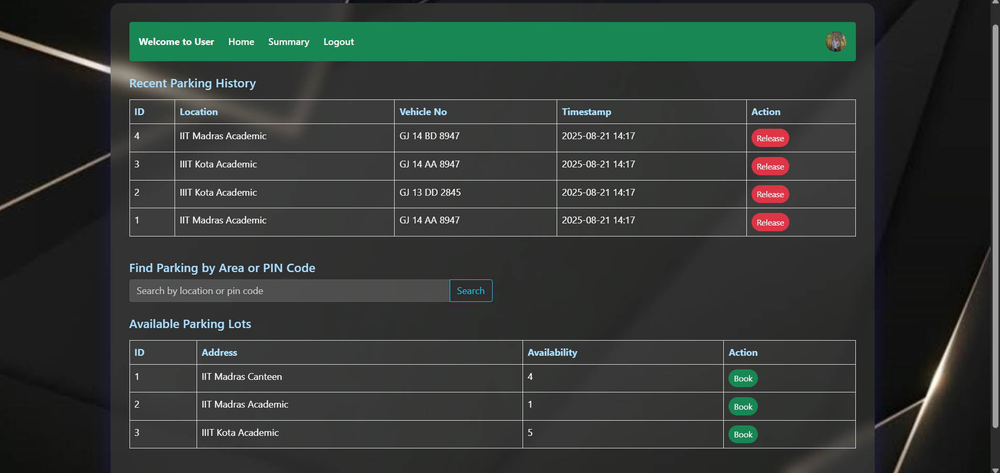
  <p><em>User Dashboard</em></p>
</div>  

<div align="center">
  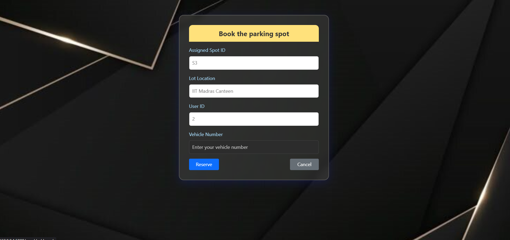
  <p><em>Book Parking Slot</em></p>
</div>  

<div align="center">
  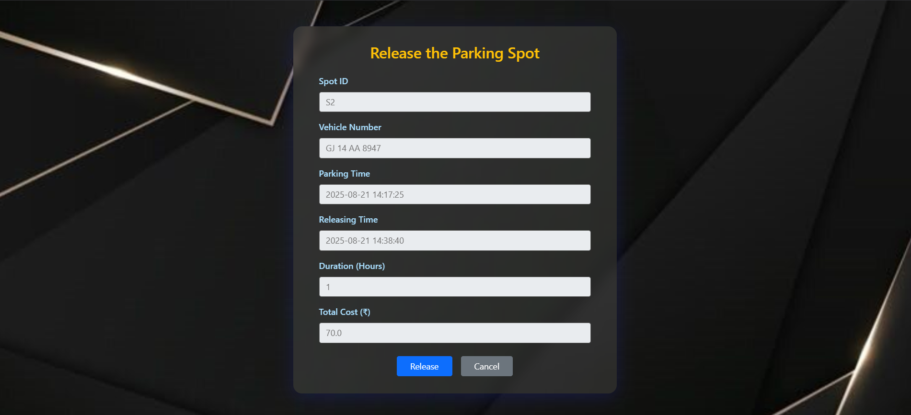
  <p><em>Release Parking Slot</em></p>
</div>  

<div align="center">
  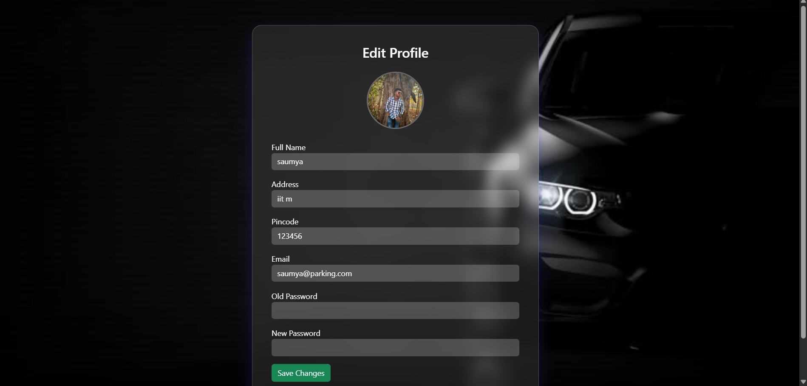
  <p><em>Edit Profile Details</em></p>
</div>  

<div align="center">
  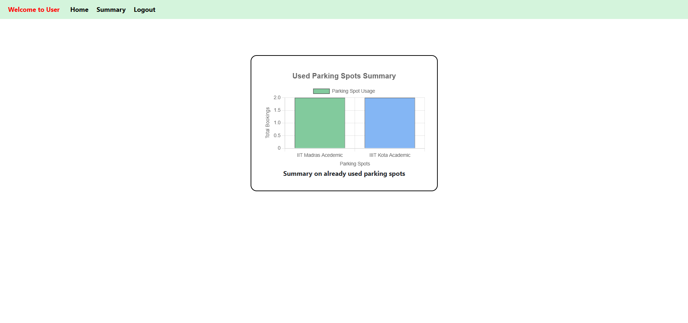
  <p><em>Edit Summary Details</em></p>
</div>  

---

### 🛠️ Admin Side  
<div align="center">
  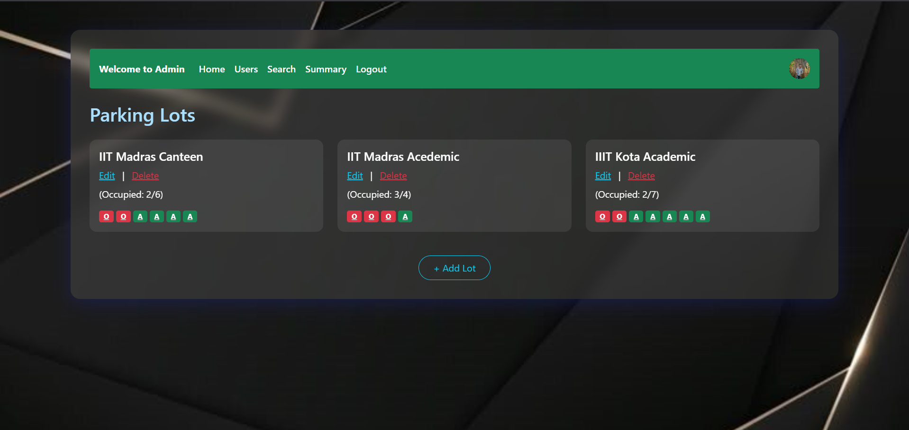
  <p><em>Admin Dashboard</em></p>
</div>  

<div align="center">
  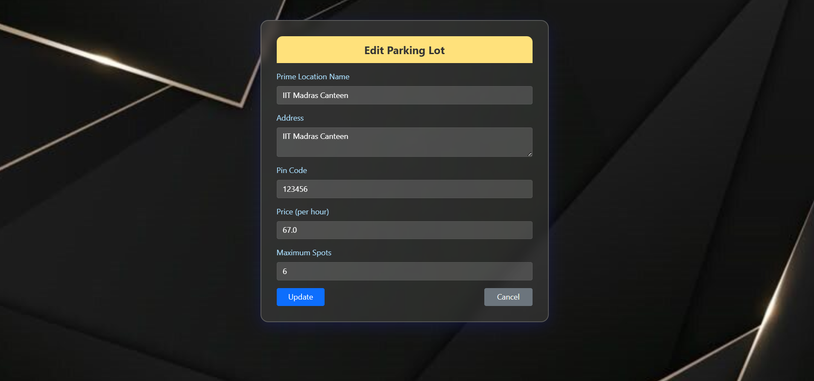
  <p><em>Manage Parking Lots</em></p>
</div>  

<div align="center">
  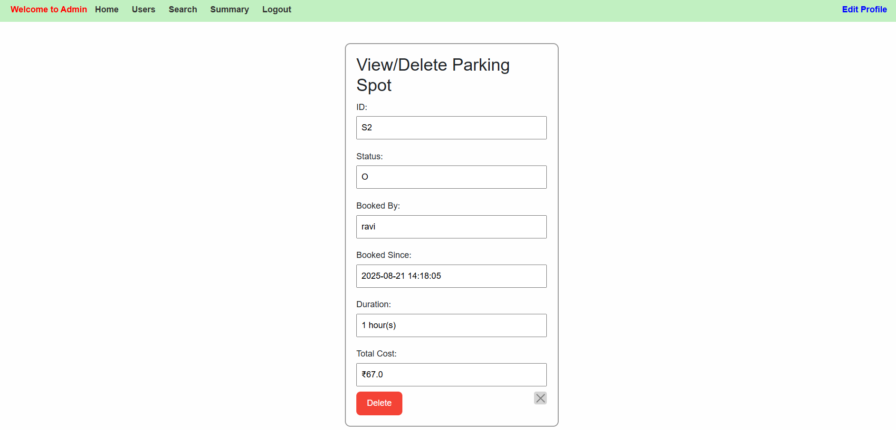
  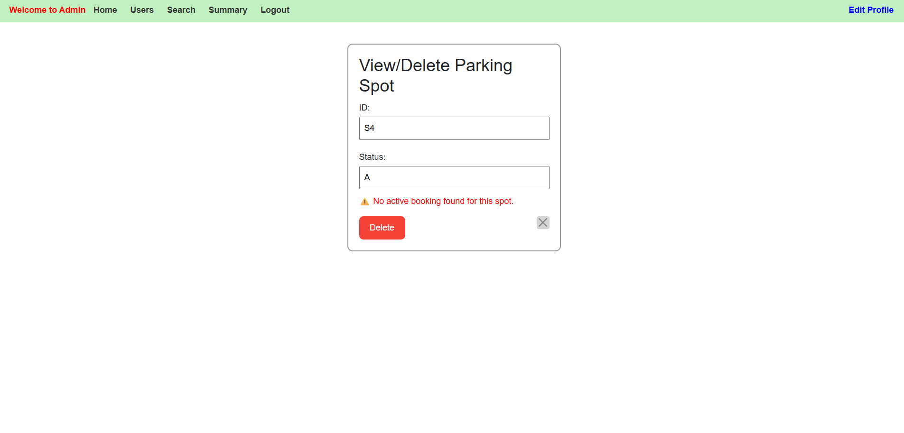
  <p><em>Manage Parking Slots</em></p>
</div>  

<div align="center">
  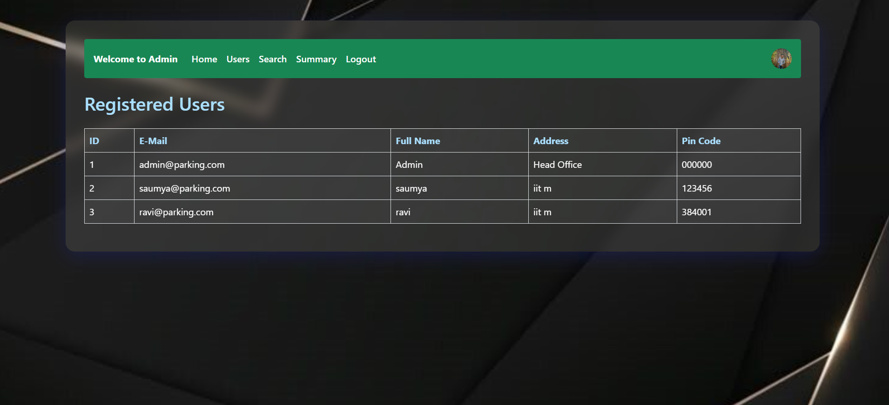
  <p><em>User Management (Admin Panel)</em></p>
</div>  

<div align="center">
  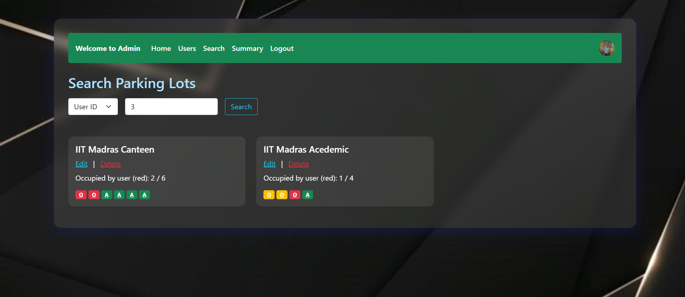
  <p><em>User/Lot History Search by Admin</em></p>
</div>  

<div align="center">
  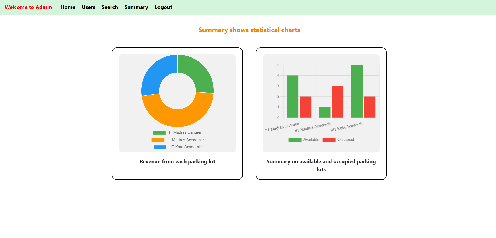
  <p><em>Summary Statistics</em></p>
</div>  


## 🎥 Demo & 📑 Report

- 📹 **Project Demo Video** → [Watch here](https://drive.google.com/file/d/16N2a9jaNi8UJuSfdkxspxa9R5pWK4Gy7/view?usp=drive_link)  
- 📄 **Detailed Report** → [Read here](https://drive.google.com/file/d/1gTLZR2rXtIMQm7XTYcfMtT2Q0gUt-9-Y/view?usp=drive_link)  
- 🌍 **Deployment URL:** → [Click here](https://vehicle-parking-app-to1m.onrender.com/) 
---

## 🚀 Future Enhancements

- Real-time slot availability with IoT integration
- Payment gateway for booking confirmation
- QR-code based entry/exit system
- Push notifications for booking reminders
- Integration with Google Maps for slot navigation

---

## 🤝 Contributing

Contributions are always welcome!  
1. Fork the repo  
2. Create your feature branch (`git checkout -b feature/AmazingFeature`)  
3. Commit changes (`git commit -m 'Add some AmazingFeature'`)  
4. Push to the branch (`git push origin feature/AmazingFeature`)  
5. Open a Pull Request  

---

## 📜 License

This project is licensed under the **MIT License** - see the [LICENSE](LICENSE) file for details.

---

## 👨‍💻 Author

Developed with ❤️ by **Saumyakumar Chauhan**  
📧 Contact: 24f1000666@ds.study.iitm.ac.in  
🔗 GitHub: [Saumyakumar](https://github.com/saumyakumarchauhan)
